# Baza danych medycznych

# Spis treści

- [Baza danych medycznych](#baza-danych-medycznych)
- [Spis treści](#spis-treści)
- [Wprowadzenie](#wprowadzenie)
- [Opis wymagań systemu](#opis-wymagań-systemu)
  - [Cele systemu](#cele-systemu)
  - [Do kogo zdresowany jest system](#do-kogo-zdresowany-jest-system)
  - [Zakres systemu](#zakres-systemu)
  - [Wymagania wobec systemu](#wymagania-wobec-systemu)
- [Tabela CRUD](#tabela-crud)
- [Przypadki użycia](#przypadki-użycia)
  - [Diagram przypadków użycia](#diagram-przypadków-użycia)
- [Specyfikacja programu](#specyfikacja-programu)
  - [Panel logowania](#panel-logowania)
    - [Pacjent](#pacjent)
    - [Personel](#personel)
  - [Panel główny](#panel-główny)
    - [Pacjent](#pacjent-1)
    - [Personel](#personel-1)
  - [Wybór pacjenta](#wybór-pacjenta)
  - [Panel administratora](#panel-administratora)
    - [Panel główny administratora](#panel-główny-administratora)
    - [Edytowanie roli](#edytowanie-roli)
    - [Dodawanie użytkownika](#dodawanie-użytkownika)
    - [Dodawanie wyników badań](#dodawanie-wyników-badań)
  - [Wpisy](#wpisy)
    - [Pacjent](#pacjent-2)
    - [Personel](#personel-2)
  - [Recepty](#recepty)
    - [Pacjent](#pacjent-3)
    - [Personel](#personel-3)
  - [Skierowania](#skierowania)
    - [Pacjent](#pacjent-4)
    - [Personel](#personel-4)
  - [Wyniki badań](#wyniki-badań)
    - [Pacjent](#pacjent-5)
    - [Personel](#personel-5)

 # Wprowadzenie

System służący do gromadzenia wszystkich danych medycznych pacjenta w jednym miejscu. Jego celem jest wsparcie pacjentów i lekarzy w optymalizacji leczenia, uwzględniając pełną historię medyczną pacjenta, dostępną w dowolnym miejscu i czasie. Dzięki temu nie zachodzi potrzeba pozyskiwania informacji od źródeł zewnętrznych ani od samego pacjenta. 

# Opis wymagań systemu

## Cele systemu
  - Dostęp do ważnych informacji medycznych dla użytkowników systemu
  - Ułatwienie diagnozy i wywiadu medycznego dla lekarzy, zdejmując obowiązek
  spamiętywania swojej historii medycznej przez pacjenta
  - Digitalizacja całej historii medycznej pacjentów
  - Posiadanie wszystkich danych medycznych w jednym miejscu
  - Zachowanie bezpieczeństwa wrażliwych danych

## Do kogo zdresowany jest system
  - **Pacjenci:** Otrzymują dostęp do swojej pełnej historii medycznej, recept oraz skierowań. Mają dostęp do swoich pełnych danych zdrowotnych lub  przypadku opiekunów prawnych – do danych medycznych swoic podopiecznych 
  - **Ratownicy Medyczni:** Grupa posiada dostęp do przeglądania historii medycznej pacjenta w celu uniknięcia potencjalnych powikłań, które mogą wystąpić z powodu przeszłych zabiegów/chorób pacjenta.
  - **Technicy medyczni:** Posiadają oni możliwość dodawania do systemu różnego rodzaju wyników badań, a także specjalistycznych zdjęć. Nie mogą oni natomiast dowiadywać się niczego o danych pacjenta.
  - **Lekarze:** Mogą przeglądać, tworzyć oraz edytować wpisy w historii medycznej swoich pacjentów, co ułatwia śledzenie przebiegu leczenia. Posiadają również możliwość wystawiania recept oraz skierowań. Funkcje systemu wspierają lekarzy w ich pracy, poprzez znaczne ułatwienie dostępu do danych medycznych, co przekłada się na efektywność leczenia.
  - **Administratorzy systemu:** Odpowiadają za zarządzanie użytkownikami systemu, w tym dodawanie kont personelu medycznego lub pacjentów. Są również odpowiedzialni za przydzielanie i odbieranie uprawnień zarejestrowanych użytkowników.

## Zakres systemu
  - **Zarządzanie danymi pacjentów i dokumentacją medyczną:** System pozwala na centralizację wszystkich danych pacjentów, w tym historii chorób, wyników badań, recept oraz skierowań. Każdy wpis medyczny jest wyświetlany w sposób uporządkowany, co umożliwia lekarzom szybki dostęp do pełnej dokumentacji pacjenta i skraca czas potrzebny na analizę danych.
  - **Obsługa procesów medycznych:** System wspiera codzienne operacje medyczne, takie jak wystawianie recept, skierowań oraz aktualizację historii leczenia. Lekarze mogą wprowadzać nowe wpisy do dokumentacji, co umożliwia bieżące śledzenie stanu zdrowia pacjentów, a administratorzy mogą zarządzać strukturą kont i powiązań rodzinnych.
  - **Bezpieczeństwo i ochrona danych:** System zapewnia zaawansowaną ochronę danych poprzez szyfrowanie, system uwierzytelniania oraz szczegółowe śledzenie zmian. Mechanizmy kontroli dostępu gwarantują, że tylko uprawnieni użytkownicy mają dostęp do danych pacjentów. System jest zgodny z przepisami prawnymi dotyczącymi ochrony danych osobowych (np. RODO).
  - **Tworzenie kopii zapasowych i przywracanie danych:** W celu minimalizacji ryzyka utraty danych system automatycznie tworzy kopie zapasowe, które można łatwo przywrócić w przypadku awarii. Procedury backupu są regularni sprawdzane, aby zapewnić maksymalną niezawodność działania.
  - **Integracja z systemami zewnętrznymi:** System korzysta z systemów zewnętrznyc takich jak e-recepta, e-skierowanie oraz system logowania.

## Wymagania wobec systemu

  - **Wymagania funkcjonalne**
    - **Zarządzanie danymi pacjentów:** System musi umożliwiać dodawanie, edytowanie, przeglądanie i usuwanie danych pacjentów. Użytkownicy powinni mieć dostęp do historii medycznej, recept oraz skierowań.
    - **Autoryzacja i uwierzytelnianie:** System musi zapewniać bezpieczn logowanie dla pacjentów, lekarzy i administratorów, z odpowiednim poziomem dostępu na podstawie ról.
    - **Zarządzanie kontami użytkowników:** Administratorzy muszą mieć możliwość dodawania i edytowania kont całego personelu medycznego. System powinien umożliwiać tworzenie powiązań rodzinnych (np. opiekun prawny – podopieczny).
    - **Zarządzanie dokumentacją medyczną:** Lekarze muszą mieć możliwość dodawania, edytowania i usuwania wpisów w dokumentacji medycznej swoich pacjentów. Pacjenci muszą mieć możliwość przeglądania swoich wpisów oraz wpisów ich dzieci.
    - **Zarządzanie receptami i skierowaniami:** System musi umożliwiać lekarzom wystawianie, edytowanie i przeglądanie recept oraz skierowań. Pacjenci powinni mieć możliwość przeglądania recept i skierowań swoich oraz dzieci.
    - **Wyszukiwanie i filtrowanie danych:** System musi umożliwiać użytkownikom filtrowanie dokumentacji medycznej, recept i skierowań na podstawie różnych kryteriów, takich jak data, kategoria czy lekarz.
    - **Kopie zapasowe i przywracanie danych:** System musi automatycznie tworzyć kopie zapasowe danych i umożliwiać ich szybkie odzyskiwanie w przypadku awarii.
    - **Audyt i śledzenie zmian:** System musi rejestrować wszystkie operacje przeprowadzane na danych (np. kto dokonał edycji lub usunięcia danych), aby umożliwić pełną ścieżkę audytową.
    - **Integracja z systemami zewnętrznymi:** System musi posiadać odpowiedni interfejs, który wykorzystany może być do obsługi systemów zewnętrznych takich jak e-recepta lub e-skierowanie.

  - **Wymagania niefunkcjonalne**
  
    - **Wydajność:** System musi szybko reagować na zapytania użytkowników (do 5 sekund), szczególnie w przypadku operacji na dużych zbiorach danych takich jak historia medyczna.
    - **Skalowalność:** System musi być skalowalny, umożliwiając rozbudowę zarówno pod względem liczby użytkowników, jak i ilości przetwarzanych danych.
    - **Dostępność:** System musi być dostępny przez 99,9% czasu działania, z możliwością pracy 24/7, aby pacjenci i lekarze mogli uzyskać dostęp d danych w dowolnym momencie.
    - **Bezpieczeństwo:** Wszystkie dane przechowywane w systemie muszą być zabezpieczone poprzez szyfrowanie oraz zaawansowane mechanizmy kontroli dostępu. System musi być odporny na ataki pokroju SQL Injection i DDoS.
    - **Łatwość użycia:** Interfejs użytkownika musi być intuicyjny i prosty w obsłudze, umożliwiając szybkie i bezproblemowe korzystanie zarówno przez pacjentów, lekarzy, jak i administratorów.
    - **Zgodność z przepisami:** System musi być zgodny z obowiązującymi regulacjamiprawnymi dotyczącymi ochrony danych osobowych, np. RODO, co obejmuje prawo pacjentów do wglądu i usunięcia swoich danych.

# Tabela CRUD
Tabela CRUD przedstawia wszystkich użytkowników naszego systemu oraz określa, które klasy mogą wykonywać poszczególne funkcje.

Pacjent: -R--\
Lekarz: CRU-\
Ratownik: -R--\
Specjalista: CR--\
Administrator: CRU-

# Przypadki użycia

## Diagram przypadków użycia

# Specyfikacja programu 

## Panel logowania 
### Pacjent
W panelu logowania pacjent loguje się za pomocą numeru PESEL oraz hasła. Jeśli którakolwiek z tych danych została wprowadzona nieprawidłowo lub numer PESEL jest za krótki, system wyświetla komunikat o błędnym numerze PESEL, haśle lub zbyt krótkim numerze PESEL. Po poprawnym wprowadzeniu numeru PESEL oraz hasła pacjent zostanie przeniesiony do panelu głównego.

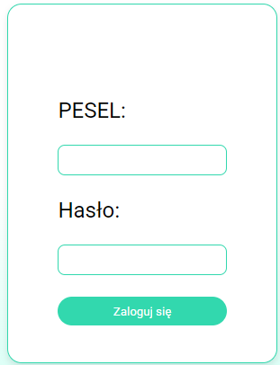

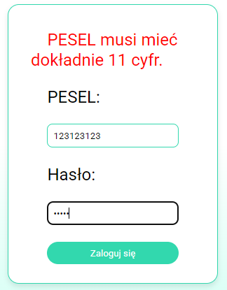

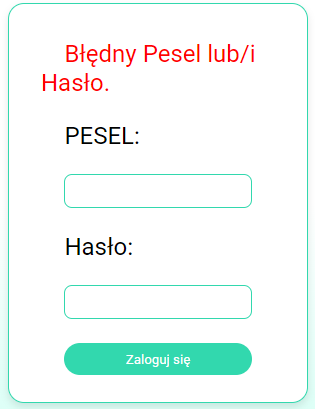

### Personel
W panelu logowanie personelu pracownik loguje się przy pomocy ID oraz hasła. Jeśli jedna z tych dwóch danych zostaqła wprowadzona nieprawidłowo, system wyświetla komunikat o błednym numerze ID lub haśle. Po poprawnym podaniu numeru ID oraz hasła personel zostanie przeniesiony do panelu głównego personelu.

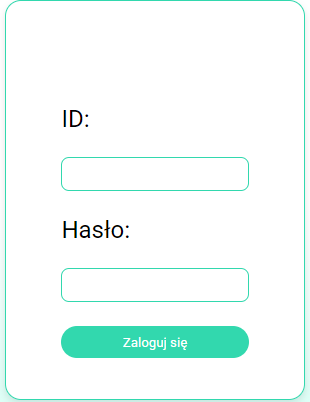

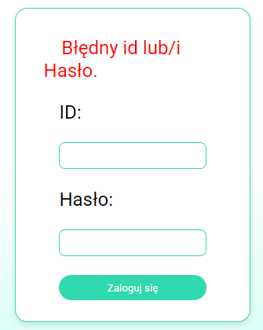

## Panel główny 
### Pacjent
Po zalogowaniu pacjent zobaczy panel główny z polami wyświetlającymi informacje o wpisach, receptach, skierowaniach oraz wynikach badań.  

W prawym górnym rogu znajdą się dane pacjenta, takie jak numer PESEL, imię, nazwisko, alergie oraz grupa krwi.  

Po wysunięciu paska z lewej strony będą widoczne zakładki: **Home, Wpisy, Recepty, Skierowania** oraz **Wyniki badań**. Kliknięcie w zakładkę przeniesie pacjenta na dedykowaną podstronę ze szczegółowymi informacjami.  

Dodatkową funkcją systemu jest możliwość przełączenia się na konto podopiecznego, jeśli pacjent jest jego opiekunem prawnym.

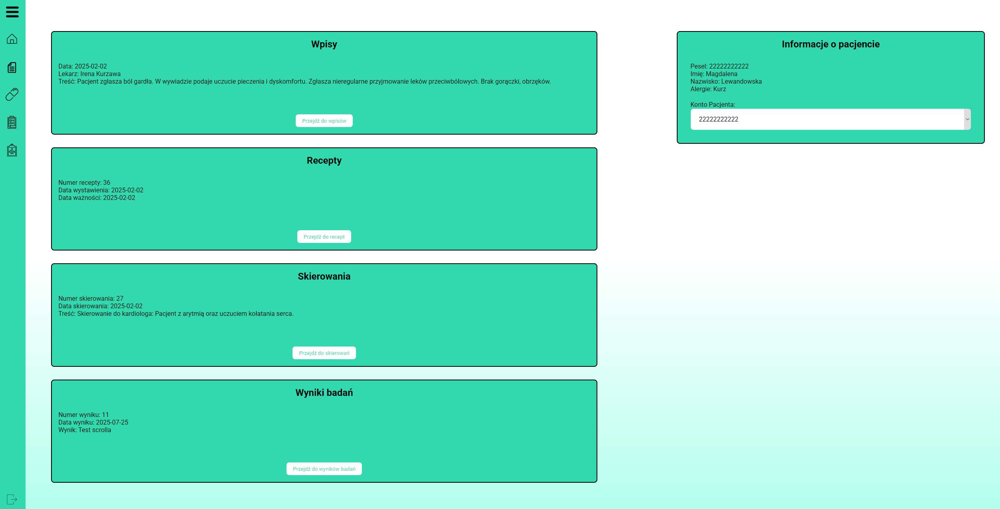

### Personel
Po wybraniu pacjenta lekarz oraz ratownik przenoszeni są do panelu głownego pacjenta.

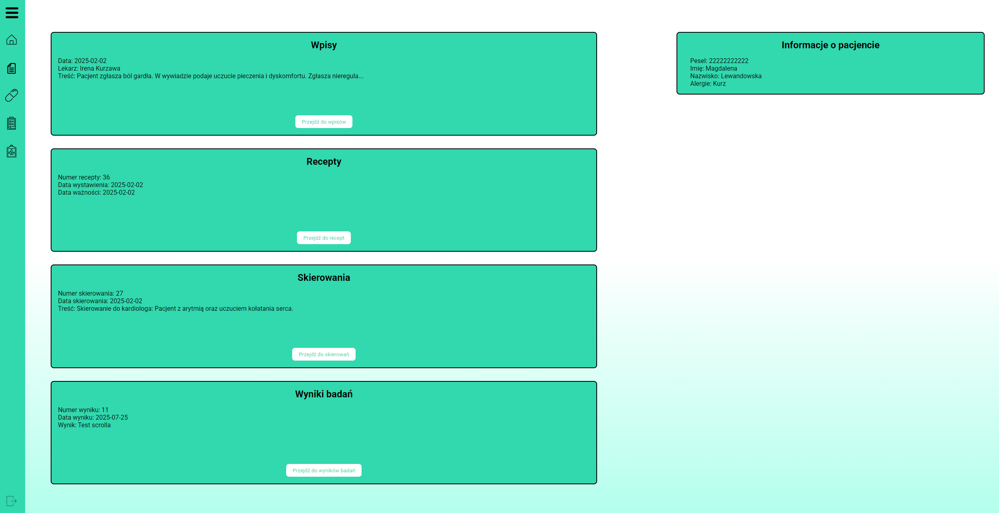
## Wybór pacjenta 
Po zalogowaniu personel będzie mógł wyszukać swojego pacjenta, podając dwie dowolne dane lub numer PESEL, a następnie klikając przycisk „Szukaj”.\
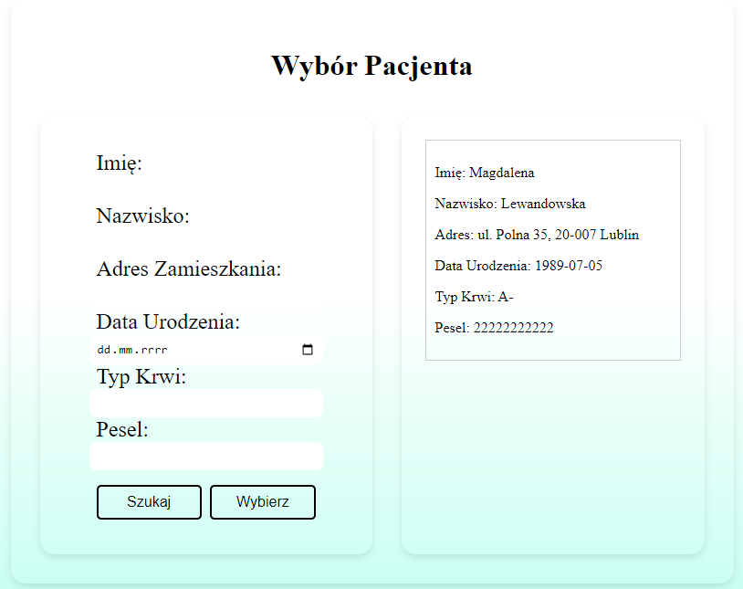

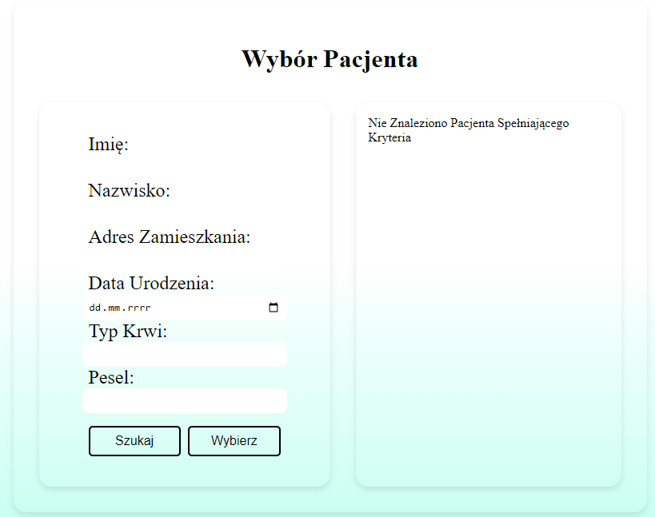

## Panel administratora
### Panel główny administratora
Po zalogowaniu się administarator widzi całą listę uzytkowników systemu.

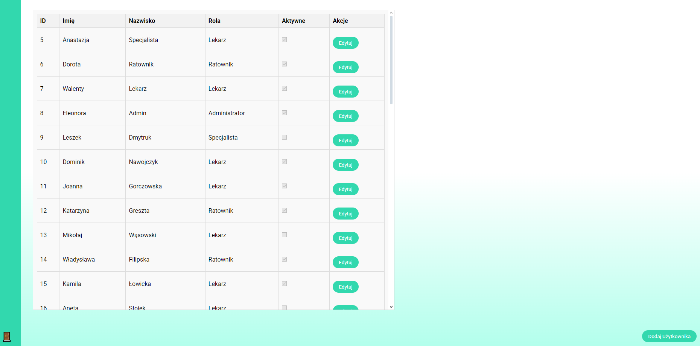

### Edytowanie roli
Administrator może zmienić rolę personelu, klikając przycisk „Edytuj”, wybierając nową rolę, a następnie zapisując zmiany przyciskiem „Zapisz”.

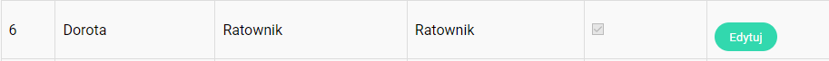
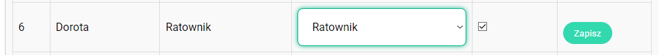

### Dodawanie użytkownika
Administrator może dodać nowego użytkownika, klikając przycisk „Dodaj użytkownika”, uzupełniając dane, takie jak imię i nazwisko, wybierając rolę, a następnie zatwierdzając przyciskiem „Dodaj”.\
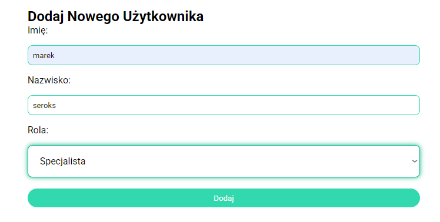
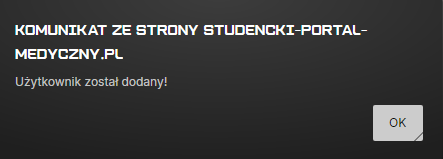
### Dodawanie wyników badań
Specjalista może dodać badania dla wyszukanego wsześniej konkretnego pacjenta poprzez opisanie ich wybranie daty oraz załączenia pliku w odpowiednim formacie :\

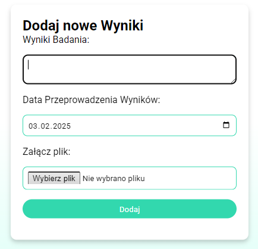
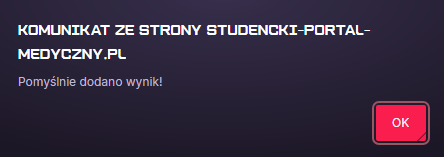
## Wpisy
### Pacjent
W zakładce "Wpisy" po lewej stronie pacjent widzi pełną listę wpisów, wraz z ich numerem, datą wystawienia oraz imieniem i nazwiskiem lekarza, który je wystawił. Po kliknięciu na wybrany wpis pacjent ma pełny podgląd tego wpisu po prawej stronie.

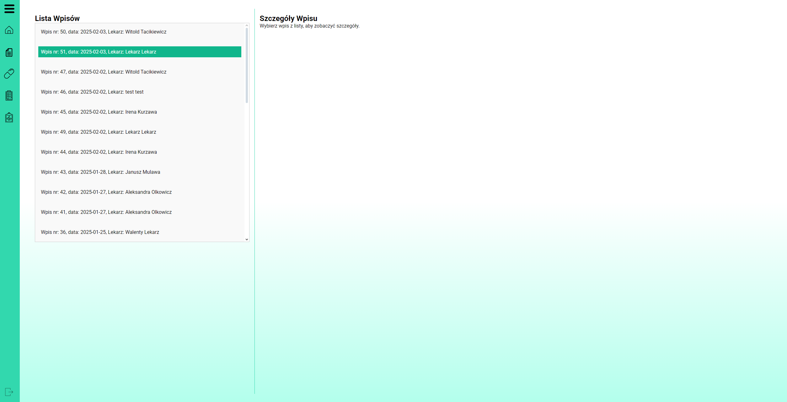

### Personel
W zakładce "Wpisy" po lewej stronie personel widzi pełną listę wpisów, wraz z ich numerem, datą wystawienia oraz imieniem i nazwiskiem lekarza, który je wystawił. Po kliknięciu na wybrany wpis personel ma pełny podgląd tego wpisu po prawej stronie.

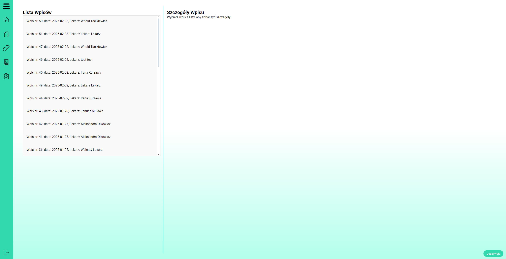

Zakładka "Wpisy" dla lekarza różni się od zakładki pacjenta jedynie tym, że lekarz ma dodatkową możliwość edytowania oraz dodawania swoich wpisów.\
Dodawanie:
Po kliknięciu przycisku w prawym dolnym rogu ekranu dodaj wpis lekarzowi wyświetli się pole do dodania go \

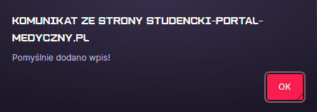

Edytowanie

Po kliknięciu przycisku edytuj bedziemy mogli edytować wpis 
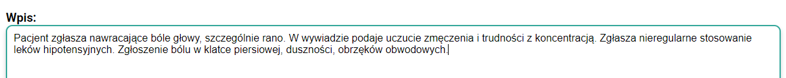
Następnie przyciskiem zapisz możemy go zapisać lub anulowac naszą edycje.\
\
W zależności od naszego wyboru strona wyświetla komunikat o zapisie edycji naszego wpisu lub o przerwaniu edycji wpisu \
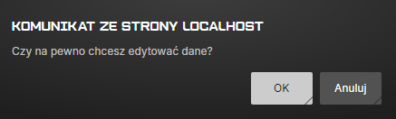
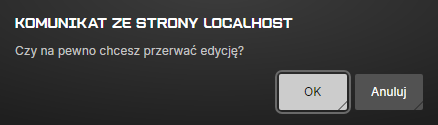
## Recepty
### Pacjent
W zakładce "Recepty" po lewej stronie pacjent widzi pełną listę recept, wraz z ich numerem, datą wystawienia i ważności oraz imieniem i nazwiskiem lekarza, który je wystawił. Po kliknięciu na wybrana receptę pacjent ma pełny podgląd do recepty po prawej stronie.

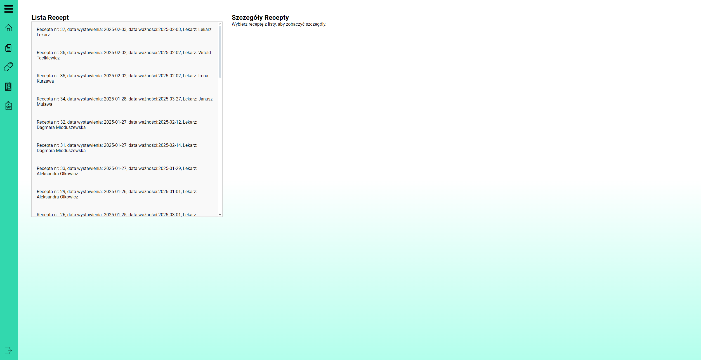

### Personel
W zakładce "Recepty" po lewej stronie personel widzi pełną listę recept, wraz z ich numerem, datą wystawienia i ważności oraz imieniem i nazwiskiem lekarza, który je wystawił. Po kliknięciu na wybrana receptę personel ma pełny podgląd do recepty po prawej stronie.

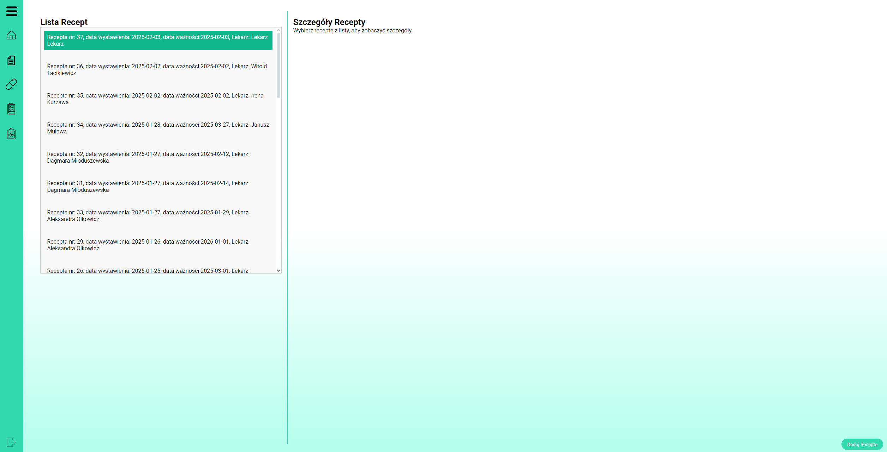

Dodawanie recepty:\
Lekarz może dodac recepte poprzez podanie nazwy,terminu recepty i czy recepta jest jednorazowa czy nie.

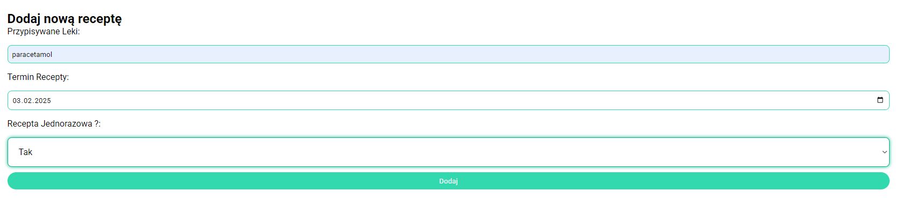
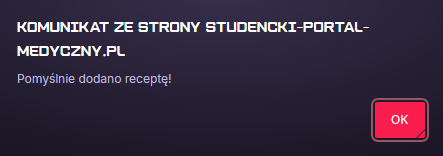
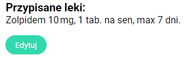
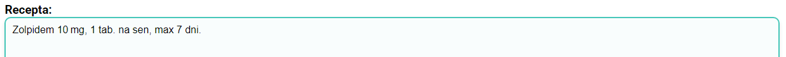

## Skierowania
### Pacjent
W zakładce "Skierowania" po lewej stronie pacjent widzi pełną listę skierowań, wraz z ich numerem, datą wystawienia oraz imieniem i nazwiskiem lekarza, który je wystawił. Po kliknięciu na wybrane skierowanie pacjent ma pełny podgląd do jego szczegółów po prawej stronie.

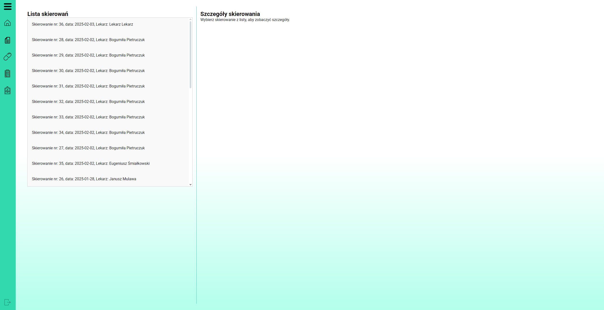

### Personel
W zakładce "Skierowania" po lewej stronie personel widzi pełną listę skierowań, wraz z ich numerem, datą wystawienia oraz imieniem i nazwiskiem lekarza, który je wystawił. Po kliknięciu na wybrane skierowanie personel ma pełny podgląd do jego szczegółów po prawej stronie.

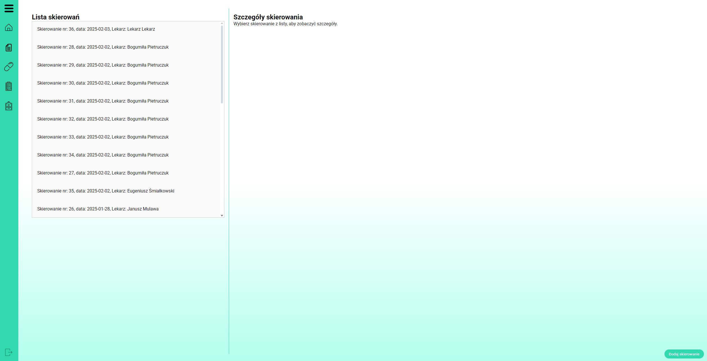

Dodawanie skierowania:\
Lekarz może dodać nowe skierowanie wypełniając pole tekstowe i kliknięcie przycisku dodaj.

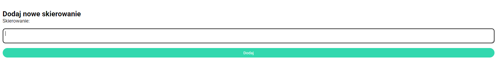
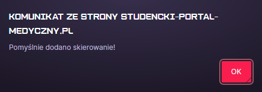

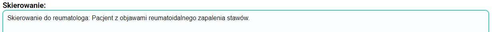

## Wyniki badań
### Pacjent
W zakładce "Wyniki badań" po lewej stronie pacjent widzi pełną liste wyników, wraz z ich numerem, datą wykonania oraz personelu wykonujący badanie. Po kliknięciu w wynik po prawej stronie wyświetlą się szczegóły wyniku.

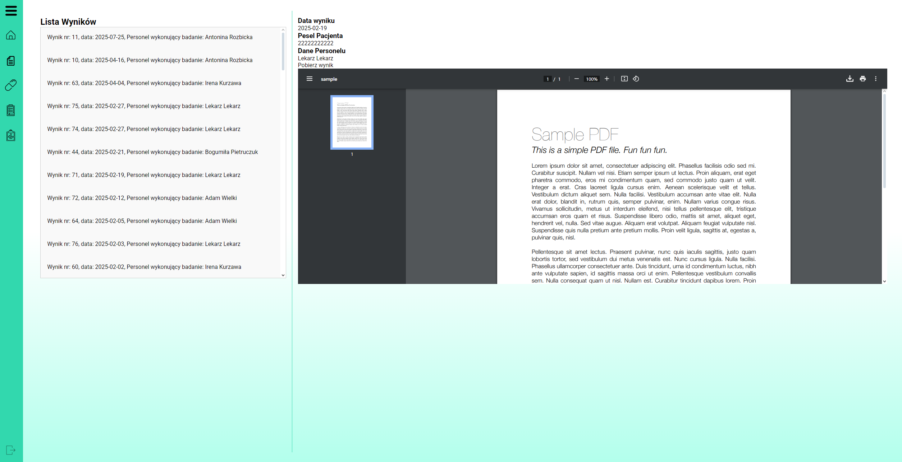

### Personel
W zakładce "Wyniki badań" po lewej stronie personel widzi pełną liste wyników, wraz z ich numerem, datą wykonania oraz personelu wykonujący badanie. Po kliknięciu w wynik po prawej stronie wyświetlą się szczegóły wyniku.

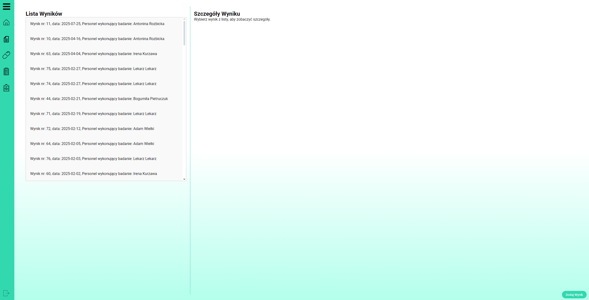

Dodawanie wyniku:\
Personel może dodać nowe wyniki badań poprzez dodanie opisu, wybrania daty oraz załączenia pliku. 

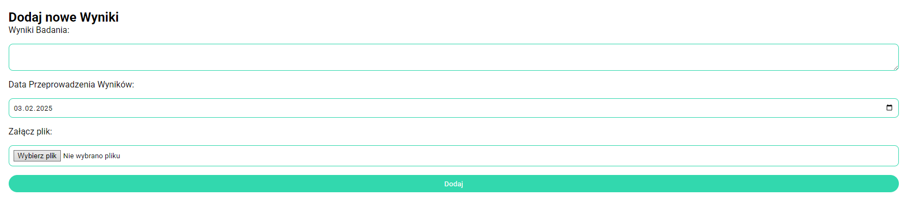